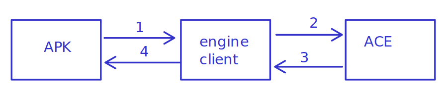

# ACE Engine 

docs on building/running/testing [here](./docs/)

CLI Program for memory scanning/editing
## Building

### Linux Desktop 

```
$ mkdir build 
$ cd build 
$ # choose either one
$ # for debugging
$ cmake -DCMAKE_BUILD_TYPE=Debug ../../../../engine/
$ # for release (optimization on)
$ cmake -DCMAKE_BUILD_TYPE=Release ../../../../engine/ 
```
```
$ make
$ # Installing
$ sudo make install
```
### Android

#### Installing prerequisites

- [android studio](https://developer.android.com/studio#downloads)(not needed
  if you only wants to run it directly on your phone)
- [android sdk](https://developer.android.com/studio/releases/platform-tools)
the program will use [ndk](https://developer.android.com/ndk) toolchain
to build on android which can be installed [here](https://developer.android.com/ndk/downloads)
or if android studio is available, it can be installed as shown [here](https://developer.android.com/studio/projects/install-ndk#default-version)

after installation is complete, the program now can be `compiled` using ndk's 
[toolchain](https://cmake.org/cmake/help/latest/manual/cmake-toolchains.7.html)

the toolchain is located at 
```
# <NDK> is the install directory
<NDK>/build/cmake/android.toolchain.cmake
```
in my linux computer(ubuntu), it is located at
```
~/Android/Sdk/ndk/21.4.7075529/build/cmake/android.toolchain.cmake
```
more detail can be found [here](https://developer.android.com/ndk/guides/cmake#file)

#### Building

`ANDROID_PLATFORM`: need to be set to atleast 23 for
		    `process_vm_readv` and `process_vm_writev`
		    support on android


`ANDROID_ABI`: need to be the same arch as the android device
	       (on android adb shell can be checked with `uname -m`)	
	       to avoid weird things from happening
	       infos on all possible ABI 
	       [here](https://developer.android.com/ndk/guides/cmake#android_abi)

```
$ mkdir build
$ cd build
$ # <NDK> is the install directory
$ # (adjust it with your own ndk's path)
$ export ANDROID_TOOLCHAIN_FILE=/home/kuhakupixel/Android/Sdk/ndk/25.2.9519653/build/cmake/android.toolchain.cmake
$ # also it can be appended with other options 
$ # like when building for x86, for debugging or for release
$ cmake -DCMAKE_TOOLCHAIN_FILE=${ANDROID_TOOLCHAIN_FILE} \
  -DANDROID_PLATFORM=android-23 -DANDROID_ABI=x86_64 .. 
$ make
```


installation with adb (android debug bridge)
```
adb push ./ACE /usr/bin/
```

more info about cmake's options:
1. [DCMAKE_TOOLCHAIN_FILE](https://cmake.org/cmake/help/latest/manual/cmake-toolchains.7.html#cross-compiling)
2. [Specify cmake's toolchain](https://stackoverflow.com/a/5099229/14073678)

### Displaying build options

after running `cmake` either for x86 or android
you can see the build options with

```
cmake -DBUILD_OPTIONS=True ..
```

## Running ACE as backend
this also can be runned as a server to provide memory scanning/editing
service for a gui 

```
./ACE attach-pid <PID TO ATTACH>
```

a port can also be specified

```
./ACE attach-pid <PID TO ATTACH> --port 56666
```

then to send message to the server, the [attach_client](./engine/client/) can be 
used, the message is the same as what you would give as a normal user to 
[ACE](./)

note that the port must be the same as the one you provided when running [ACE](./)

```
./attach_client --port 56666
(Engine Server) scan = 0

Found 8 regions to be scanned
PROGRESS_BEGIN
1/8
PROGRESS_END
PROGRESS_BEGIN
2/8
PROGRESS_END
PROGRESS_BEGIN
3/8
PROGRESS_END
PROGRESS_BEGIN
4/8
PROGRESS_END
PROGRESS_BEGIN
5/8
PROGRESS_END
PROGRESS_BEGIN
6/8
PROGRESS_END
PROGRESS_BEGIN
7/8
PROGRESS_END
PROGRESS_BEGIN
8/8
PROGRESS_END
current matches: 87350
Done in: 0.002031 s

(Engine Server) scan = 1

current matches: 1
Done in: 0.001786 s

(Engine Server) list

0x7ffe0fdbdbc8 1

```


Also, you can run it as a one time command and output by using 
`--msg` options

```
./attach_client --msg "attached" --port 56666
attached_ok
```

```
./attach_client --port 56666 --msg reset
resetting all scan
```

```
./attach_client --port 56666 --msg "scan = 0"
Found 8 regions to be scanned
PROGRESS_BEGIN
1/8
PROGRESS_END
PROGRESS_BEGIN
2/8
PROGRESS_END
PROGRESS_BEGIN
3/8
PROGRESS_END
PROGRESS_BEGIN
4/8
PROGRESS_END
PROGRESS_BEGIN
5/8
PROGRESS_END
PROGRESS_BEGIN
6/8
PROGRESS_END
PROGRESS_BEGIN
7/8
PROGRESS_END
PROGRESS_BEGIN
8/8
PROGRESS_END
current matches: 87337
Done in: 0.001447 s

```
### Using in apk

Running the binary and getting the output as mentioned in 
previous sectioni s the only way
AFAIK to use [ACE](./) in android, you cannot run it using jni
because [jni can't run as root, you can only run native binary as root](https://stackoverflow.com/a/7102780/14073678)

for POC checkout [ATG](../ATG/)'s source code 

### Architecture


[ACE](./) used [ZMQ](https://github.com/zeromq/libzmq) for IPC via sockets
so the client/apk will have to also use it in order to send/receive message
using `ZMQ` can be hard because of the implementation details on a certain 
programming language (binding, and etc).

Thats why `attach_client` is used as the middleman
to faccilitate the communication, so the apk only have to run 
`attach_client` binary, without having to know/use `ZMQ`

of course, because we each piece simpler
the system as a whole is less efficient, because now we have middleman
though it shouldn't be a problem in most cases since the apk
shouldn't need to send many request quickly


## Using it in your cpp project
You can also use [ACE](./) directly in your cpp project 

the recommended way is to include this repo as a submodule
to your git repo, 

check [this repository](https://github.com/KuhakuPixel/ACEAsLib) for complete example on how to use it in your cpp project

```
git submodule add https://github.com/KuhakuPixel/AceTheGame
# getting the submodule of AceTheGame repo
# https://stackoverflow.com/questions/4600835/adding-git-submodule-that-contains-another-submodule
git submodule update --init --recursive
```

then in your `CMakeLists.txt` add the following

```
add_subdirectory(./AceTheGame/ACE/engine/)

...

# link with ACE's lib
target_link_libraries(YOUR BINARY
    PRIVATE lib_ACE-static
)
# or, if you prefer dynamic library

target_link_libraries(YOUR BINARY
    PRIVATE lib_ACE
)

```


then you can send command request like `scan = 0`, `list`, pretty much the same
as the command that you would send when using 
[ACE](./) directly

```
#include "ACE/attach_client.hpp"
#include "ACE/engine_serverhpp"
#include <thread>

int target_process_pid = 1234;
int port = 56666;
// start ACE's server
std::thread server_thread = std::thread(){
    [=](){
        engine_server_start(target_process_pid, port)
    }
}
// get the client to talk to the server
attach_client client = attach_client(port);

// get addresses whose value is 0
client.request("scan = 0");

// get addresses whose value has increased
client.request("filter >");

// list matches
std::string reply = client.request("list");
printf("%s\n", reply.c_str());

// reset scan
client.request("reset");
```
