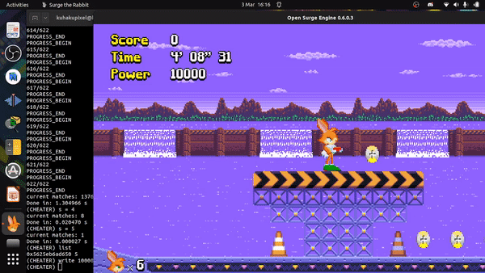
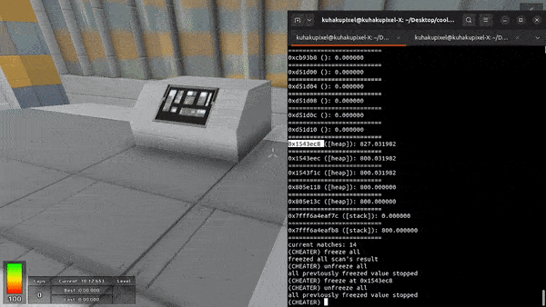

# Ace The Game

Game Guardian open source alternative for android and linux
 
that also works for non rooted android device! 

Disclaimer!!!: this program is still in beta phase 
## Showcase
### infinite coin 




### fly hack



## Installation
### Prerequisite
- adb program installed and can be run through the command prompt
 [adb download](https://developer.android.com/studio/command-line/adb)

- [download latest release of AceTheGame](https://github.com/KuhakuPixel/AceTheGame/releases/latest)
  and unzip the file to get `release` folder

  inside the `release` folder, the structure should look like 
  ```
	.
	├── android
	│   ├── bin
	│   ├── include
	│   ├── lib
	│   └── share
	├── linux
	│   ├── bin
	│   ├── include
	│   ├── lib
	│   └── share
	└── modder
	    ├── bin
	    └── lib

  ```
- open the terminal and go to the directory
  of the `release` folder
  ```
  cd [PATH TO YOUR RELEASE FOLDER]
  ```

### Rooted Device
in terminal, go to directory `./android/bin/`

```
adb push ACE /data/local/tmp
adb shell chmod +x /data/local/tmp/ACE 
```
### Non-Rooted Device
in terminal, go to directory `./android/bin/`

```
adb push engine_client /data/local/tmp
adb shell chmod +x /data/local/tmp/engine_client 
```
this binary will be used to scan and edit memory of the apk

#### Optional:
for alternative install directory that is available in android
look [here](https://android.stackexchange.com/questions/45554/running-own-executable-on-android-shell)

## Usage
Notes: type command `-h` to list all available commands

[video tutorial](https://www.youtube.com/watch?v=UlGm1nFxRzA)

### Rooted Device
open up adb shell and go to the program location
```
adb shell
cd /data/local/tmp
```

```
./ACE
```
then you should see the following promp
```
You are rooted, all feautres will work

ACE Engine, a game hacking tools for linux and android

Copyright (C) 2022 AceEngineSoftware@gmail.com
Author: Kuhaku Pixel (https://github.com/KuhakuPixel)

For update news, feature request and discussion regarding 
Ace Engine
Discord Server: https://discord.com/invite/MhrFwpYm
================= IMPORTANT ==============================
before using this software type `license` command and enter
to view the license of the software.

(ACE) 
```
#### list running process
list running processes with
```
ps ls
```

```
(ACE) ps ls
...
...
52507 brave
52641 brave
52778 adb
52785 kworker/4:2-events
52850 brave
52867 brave
52889 brave
54795 opensurge
```
#### select running process
lets say we want to attach to `opensurge
```
(ACE) cheater 54795

```
now you should be attached
```
attaching to process 54795 
set type to int
(CHEATER)
```


#### Scanning for value
lets say in the game, there is a coin with value of `3`
we gonna have to search for the address of that coin
in order to have infinite coin

```
(CHEATER) scan = 3
```

then its gonna take a while and output something like
```
current matches: 13946
Done in: 1.347762 s
```

now we just change the coin value in the game 
and scan for the changed value to further filter 
all of the addresses that we got

lets say we collect one more coin so our coin becomes
`4` right now

we just scan for 4

```
(CHEATER) scan = 4
```

```
current matches: 20
Done in: 0.021650 s
```
repeat the steps above
until you got 1-3 matches

#### writting to matches
now that you have the address of the coin which 
can be seen by the list command
```
(CHEATER) list
0x55b525a27650 7
```
you can write any value you want to it by using
```
(CHEATER) write 999999
```
and now you should have `999999` coin


### Non-Rooted Device

for this program to work on non rooted device
you gonna need to patch the apk it self to add 
"Memory scanner and editor" feature. 
in the release folder go to folder `./modder/bin`

for windows run `modder.bat` as the first command

for linux and mac, run `./modder` as the first command
in your pc

in this tutorial, im gonna run  the first command as `./modder`
note: run ./modder --help for more info about available commands

#### Downloading apk

listing all installed apk
```
./modder list
```

find the apk you want to hack, lets say
its called appleknight

```
...
305 online.limitless.appleknight.free
...
```

download it to your pc using
```
./modder download online.limitless.appleknight.free
```

after download, you should have folder called
`online.limitless.appleknight.free`
#### Attaching memory scanner
```
./modder patch online.limitless.appleknight.free/ true
```
this will take a while since it has to recompile,
attach memory scanner, recompile and resign the apk

after it is done, it should create a folder called
that ends with `.patched`, in this case

it created `online.limitless.appleknight.free.patched`
which is the folder that contains the patched apk


#### Installing patched apk
the syntax of installing apk is 

- uninstall the previous apk on your android device
- go to the folder of patched apk  in terminal
  `online.limitless.appleknight.free.patched`

  and run 

  ```
  adb install-multiple base.apk split_config.arm64_v8a.apk
  ```

#### scanning and editing memory 

1. start the apk
2. run 
   ```
   adb shell

   ```

   ```
   cd /data/local/tmp
   ```
3. run the engine client  
 
   ```
   ./engine_client
   ```
   which should output
   ```
   Connecting to ACE engine server...
   (Engine Server)
   ```

   try to run `attached` command to see
   if we it has been connected to the apk
   that we try to hack
   ```
   (Engine Server) attached
   
   attached_ok

   ```
4. scanning and editing memory
   this step is similliar to the step of 
   rooted device, infact all the commands  
   is the same as the program for rooted device
   to scan for value 5

   ```
   (Engine Server) scan = 5
   ```
   to write value `1000` to all matches
   's addresses

   ```
   (Engine Server) write 1000 
   ```


## Build instruction
### clone repo
#### https
```
git clone --recurse-submodules https://github.com/KuhakuPixel/AceTheGame.git
```
#### ssh
```
git clone --recurse-submodules git@github.com:KuhakuPixel/AceTheGame.git
```

... TO be added

