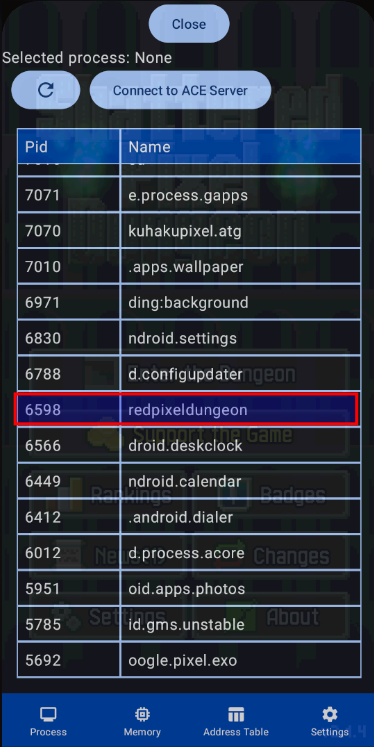
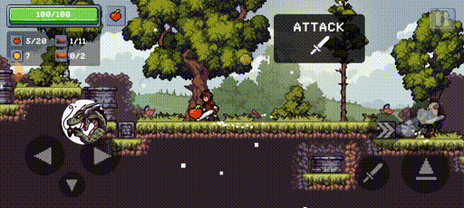
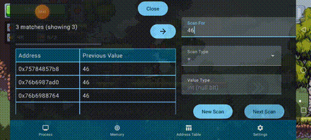
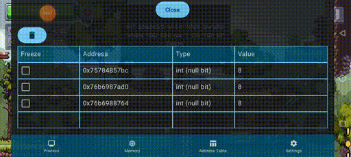

# Ace The Game

  

  <h2><a href="https://github.com/KuhakuPixel/AceTheGame/releases/latest"> Download </a></h2>

  <h2><a href="./installation_guide.md"> Installation Guide </a></h2>

  <h2><a href="./tutorial/quick_start.md"> Quick Start </a></h2>

  <h2><a href="https://github.com/KuhakuPixel/AceTheGame/issues"> Bug Report </a></h2>

  <h2><a href="https://github.com/KuhakuPixel/AceTheGame/issues/60"> Roadmap </a></h2>
  <h2><a href="./contributing.md"> Contributing  </a></h2>

- Memory scanner and editor for 
  android and linux

- Non rooted support for android via apk patching (still alpha)

- Game Guardian open source alternative for android

- Game hacking tools for modifying health, coin and etc
  
Disclaimer!!!: this program is still in beta phase 

for discussion, suggestion and question
feel free to join [the discord server](https://discord.gg/8fJh9tPVXb)

## Showcase
### Gui Apk

### infinite coin 

### fly hack

### value freezeer
(freezing the health value)

