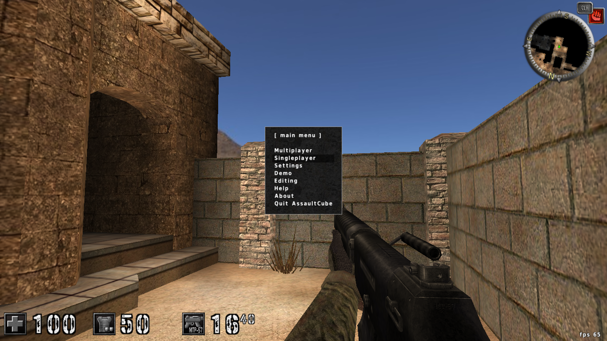
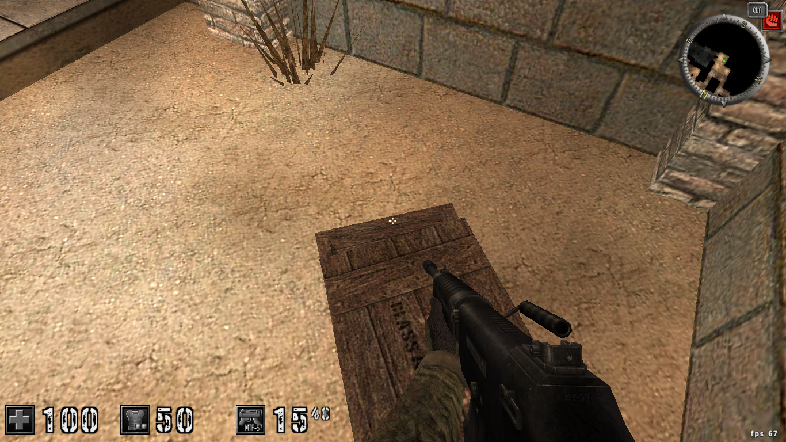
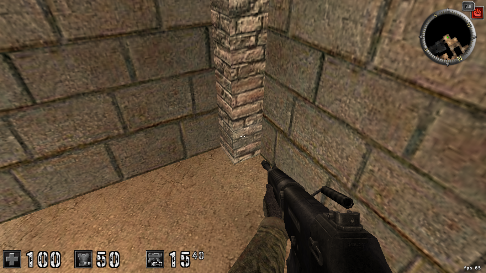
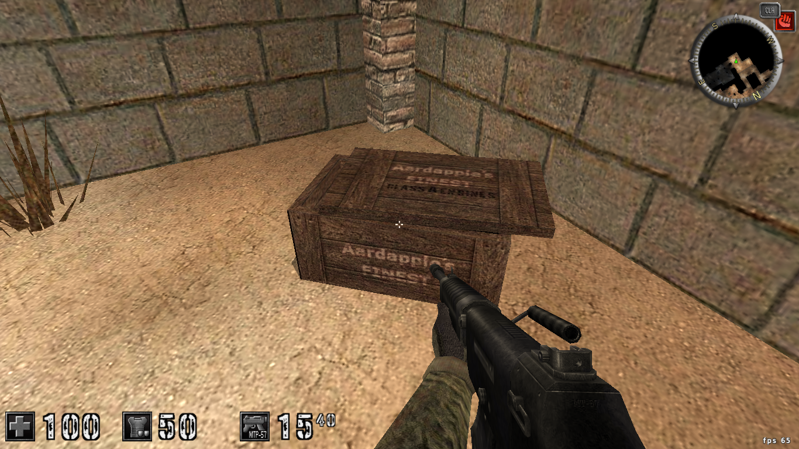
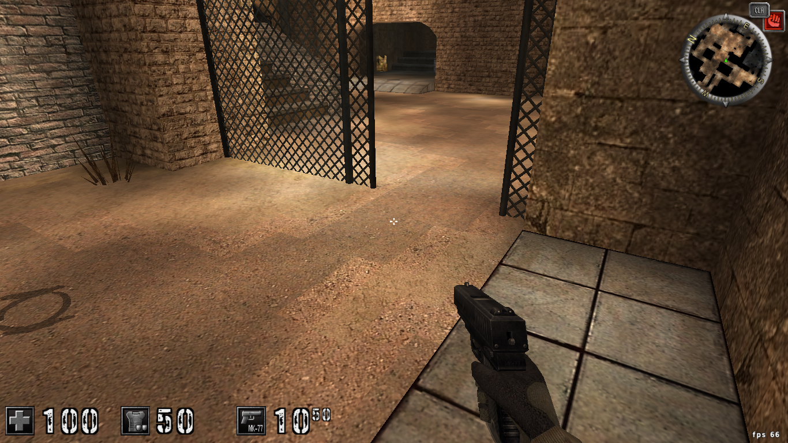

# Fly Hack

Will show how to create a fly hack in fps called `Assault Cube`
by finding address player's y position and `freezing` it to fly



Okay, how should we find the freaking value?
unlike scanning for currency address where we know the exact value

we don't even know the position's value, it can be anything
`1`,`1.2121`,`92121.323`, `619`, `god know what else :)`

`scan for unknown initial value` to the rescue :D

by doing that, we essentially just pick all addresses
of the game memory as a match and we will filter down
on the value from that 


## Selecting Process 
in this example, the pid and name is 
```
35019 linux_64_client
```

so lets select that

```
(ACE) cheater 35019
attaching to process 35019
```

## Changing Value Type

Because in a game, a position will usually
be stored as a decimal (float)

so we should change the value type as well by doing

```
(CHEATER) config type float
set scan level to float
```

## Scanning

Now we just do scan for unknown initial value

```
...
(CHEATER) s ? 0
current matches: 186442752
Done in: 4.670517 s
```

to filter down those matches, we can change our player's y

the easiest and my most preferable way is to go to higher or 
lower ground which will force the `y`'s value to change
and we can scan for changed value after that.

so lets put our player on top of the box 


the `y` has changed, so lets scan for that
by doing 

```
(CHEATER) f !=
current matches: 135661
Done in: 74.224466 s
```
okay, so our matches count went down drastically after the first scan

now, we will try to move around on the box and rotate our gun 
somewhere to filter out those value, and scan for value
that still stays the same (because we haven't fallen from the box)


```
(CHEATER) f =
current matches: 87317
Done in: 0.023264 s
```

okay now lets go to the ground and scan for changed value

```
(CHEATER) f !=
current matches: 5945
Done in: 0.014000 s
```

now just repeat the process above, scan for changed value if you change the player's y
and scan for unchanged value if you are sure player's y stays the same

eventually you will find addresses that looks promising :D
fastforward I have found addresses 

```
(CHEATER) list
0x12b5b70 9.500000
0x12b5b94 5.000000
0x12b5f3c 9.500000
0x12b5f78 9.500000
0x12b5f84 9.500000
0x138db98 9.500000
0x138dc04 9.500000
0x1623ff8 9.500000
0x2c6122c 5.000000
0x2dbb4f8 9.500000
0x7ffc9a1dba68 9.500000
```
this looks promising, but to make sure we have the correct address
lets try to move our player down and see the current value



(we can use `update list` to update our matches's value to the newest one)

```
0x12b5b70 5.500000
0x12b5b94 1.000000
0x12b5f3c 5.500000
0x12b5f78 5.625000
0x12b5f84 5.500000
0x138db98 5.500000
0x138dc04 5.500000
0x1623ff8 5.500000
0x2c6122c 1.000000
0x2dbb4f8 5.500000
0x7ffc9a1dba68 5.500000
```

okay, we can see that all of those addresses are interesting
since all of them went down

you can use `freeze all` to freeze all of the matches's value
but its better if we try to freeze specific address with `freeze at`
command, because freezing all address that might not be our y position 
can sometimes cause crashes  

## I Believe I CAN FLY :D 
In this example, lets try to freeze the first match by using
```
(CHEATER) freeze at 0x12b5b70
```

It seems I get lucky because I got the correct address in the first match :D
(I can fly now :D)


(Don't sweat it if you crash your games multiple time by freezing the wrong address
 because this stuff is quite hard (I crashed 2 times when making this tutorial))

