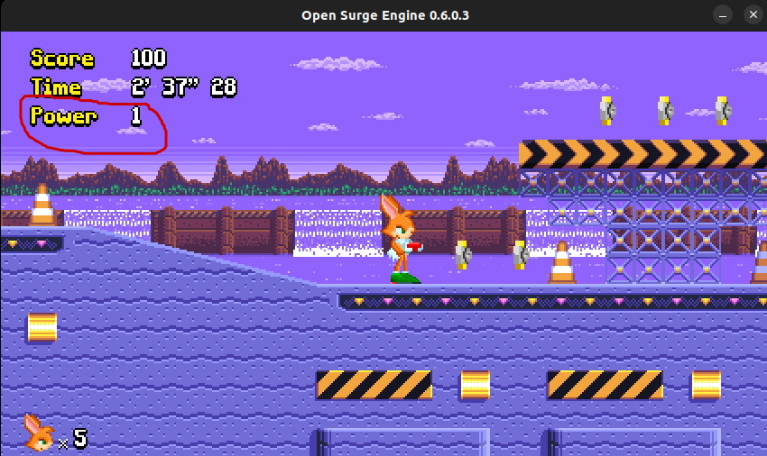
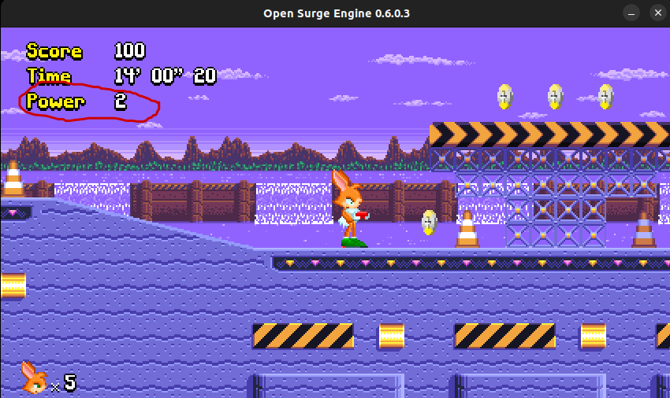
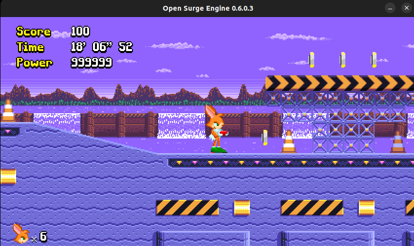

# Infinite Coin 

this tutorial will show you how to find a game's currency's address
and edit its value to any value you want

I am gonna use game called [Surge the rabbit](https://opensurge2d.org/)
on this tutorial, and we gonna try to make our `Power` value 
to be infinite





## Selecting The Process

Listing process and select the game 
(this will list the newest process at the bottom)
```
(ACE) ps ls
```

output:
```
...
29510 vim
29511 node
29544 kworker/6:1-events
29588 kworker/1:1-events
29671 kworker/2:1-events
29685 brave
29705 brave
29718 brave
29739 kworker/4:0-events
29781 opensurge
```
now that we know the pid of the process of interest,
we can select it using 

```
(ACE) cheater 29781
attaching to process 29781
```

## Finding Memory Address Of the Score
To be able to edit the score, we need to know its address
to edit its address we will scan through the memory of
the game using `exact scan`

Our current value is `1` so lets find addresses that have value of 
`1`

```
(cheater) scan = 1

...
current matches: 175363
Done in: 1.302344 s
```

we got `175363` matches WOAH :O
our value can't have that many addresses :(
it usually is a really small number

so lets fitler down the matches, to do it
we just change the value of `Power` for example 
picking a coin and scan for that changed value


the `power` is now `2` so lets scan for that

```
(CHEATER) scan = 2
current matches: 1
Done in: 0.288191 s
```

okay now we get lucky, because we found it in only 2 scan
but sometimes we have to do more scans to find the exact address

we can see the address of our matches by using `list` command

```
(CHEATER) list
0x55b493a2f650 2
```

## Writting value to address

Now we can just write any value we want to `power`
using `write` command

(this will write value to all matches's addresses in the)
```
(CHEATER) write 999999
```


or if you have multiple matches and only want to write to specific
address just use
```
(CHEATER) writeat 0x55b493a2f650 999999
```



Fun isn't it :D


