## Notes: 

- This is only a brief tutorial,
for more in depth and real practice visit [here](https://github.com/KuhakuPixel/AceTheGame/tree/master/tutorial)

- Type command `-h` to list all available commands

- For ATG, start from [here](#atg)
- For BillingHack, start from [here](#billinghack)

## Video Tutorial
- For [Apk](https://www.youtube.com/watch?v=UlGm1nFxRzA)

- For [CLI only](https://www.youtube.com/watch?v=UlGm1nFxRzA)

- Non rooted support (coming soon)

## Requirement
- Before you start, you need to download the tools (ATG) first `app-release.apk` which can be downloaded from [here](https://github.com/KuhakuPixel/AceTheGame/releases/latest)

## ATG

- ### Rooted [Apk]
   For this guide, we use `shattered pixel dungeon apk` which can be downloaded from [here](https://play.google.com/store/apps/details?id=com.shatteredpixel.shatteredpixeldungeon&hl=en&gl=US&pli=1) or simply search this game from Play Store

   1. ### Select Running Process
      First, open the ATG apk and the game you want to run this exploit for
      
      Then click on the name of the desired game
      > For example, in this case is `redpixeldungeon`

      

      > Note: If the desired game doesn't appear, make sure to click the refresh button `↻`

   1. ### Scanning For Value

      For this example, we will try to have infinite stones in this game

      As you can see, the starting stones we have right now are 3

      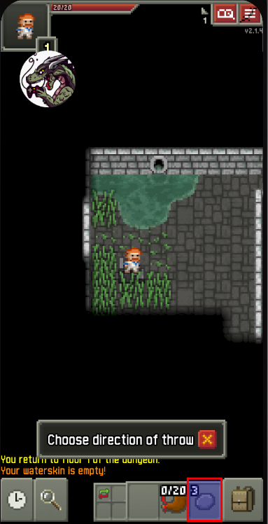

      Open the ATG and move to the `Memory` tab 
      
      Put `3` inside the `Scan For` input field as we currently have 3 stones and then press `Next Scan` to retrieve all the addresses that has the value of 3

      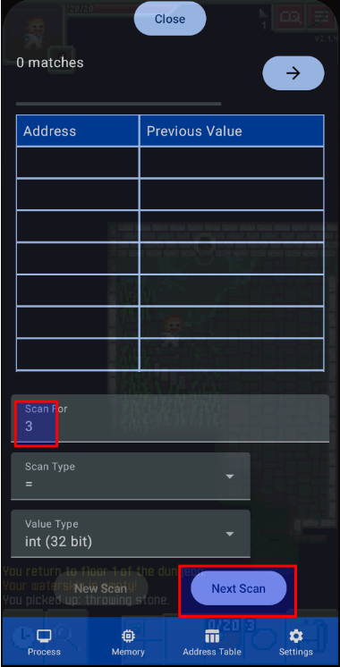

      As you can see, we have found `30840` addresses which have a value of 3

      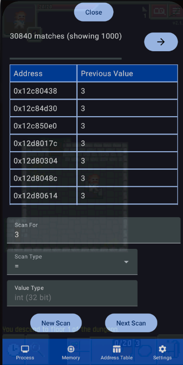

      Because the number of matching addresses is too large, we need to filter down the number of matching addresses by increasing/decreasing the stone value and scan for that increased/decreased value

      In this case, we are gonna throw away the rock to decrease its value to `2`

      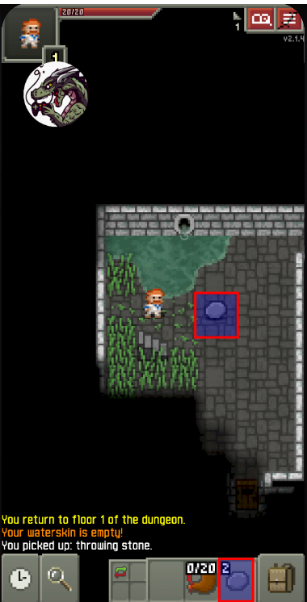

      Repeat the step above by putting `2` (since we have reduced the stone value) inside the `Scan For` input field and press `Next Scan` to retrieve all the addresses that has the value of 2

      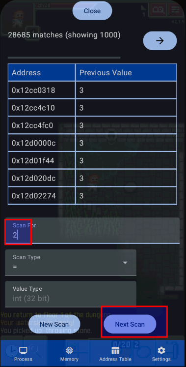

      As we can see, the number of matching addresses have reduced to 4

      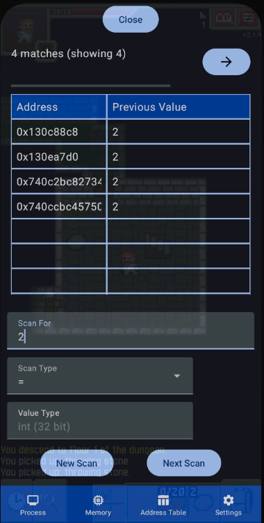

      > Repeat the steps above as many times as possible if you think the number of matching addresses is still too large

      Now, we have narrowed down the address enough to start editing its value :D, just click on the remaining address and it will be added to the `Address Table` tab, where you can start editing its value to your desired value

      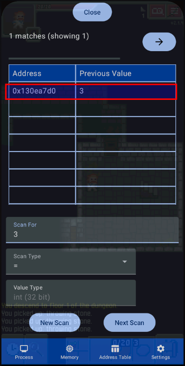

      Switch to the `address table` tab, so we can start editing its value by clicking on the `value` cell

      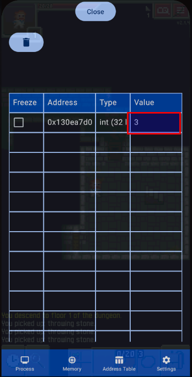

      Put any value that you wanted and press `Okay`

      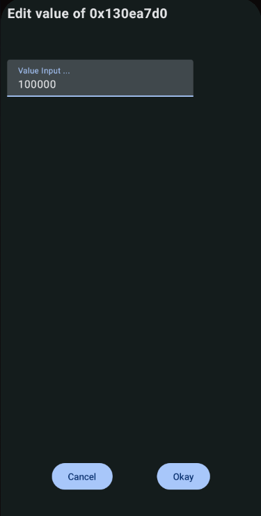

      Done :D

      > Make sure to change the rock's value by throwing it once again to update its UI

      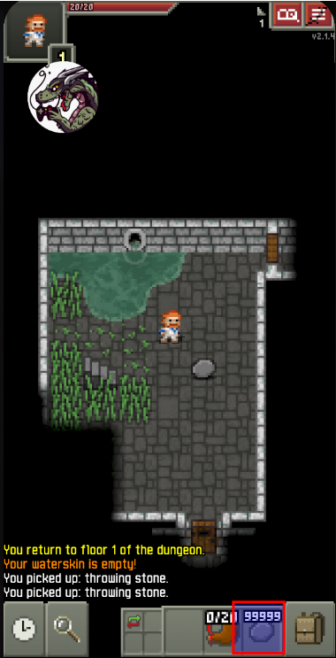


- ## CLI
   Open up adb shell and go to the program location
   ```
   adb shell
   cd /data/local/tmp
   ```

   ```
   ./ACE
   ```
   Then you should see the following promp.
   ```
   You are rooted, all feautres will work

   ACE Engine, a game hacking tools for linux and android

   Copyright (C) 2022 AceEngineSoftware@gmail.com
   Author: Kuhaku Pixel (https://github.com/KuhakuPixel)

   For update news, feature request and discussion regarding 
   Ace Engine
   Discord Server: https://discord.com/invite/MhrFwpYm
   ================= IMPORTANT ==============================
   before using this software type `license` command and enter
   to view the license of the software.

   (ACE) 
   ```
   1. ### List Running Process
      List running processes with:
      ```
      ps ls
      ```

      ```
      (ACE) ps ls
      ...
      ...
      52507 brave
      52641 brave
      52778 adb
      52785 kworker/4:2-events
      52850 brave
      52867 brave
      52889 brave
      54795 opensurge
      ```
   1. ### select running process
      Lets say we want to attach to `opensurge`
      ```
      (ACE) cheater 54795

      ```
      Now you should be attached
      ```
      attaching to process 54795 
      set type to int
      (CHEATER)
      ```


   1. ### Scanning for value
      Lets say in the game, there is a coin with value of `3`

      We gonna have to search for the address of that coin in order to have infinite coin

      ```
      (CHEATER) scan = 3
      ```

      Then its gonna take a while and output something like:

      ```
      current matches: 13946
      Done in: 1.347762 s
      ```

      Now we just change the coin value in the game and scan for the changed value to further filter all of the addresses that we got

      Lets say we collect one more coin so our coin becomes `4` right now.

      We just scan for 4.

      ```
      (CHEATER) scan = 4
      ```

      ```
      current matches: 20
      Done in: 0.021650 s
      ```

      Repeat the steps above until you got 1-3 matches

   1. ### writting to matches
      Now that you have the address of the coin which can be seen by the list command,
      ```
      (CHEATER) list
      0x55b525a27650 7
      ```
      you can write any value you want to it by using
      ```
      (CHEATER) write 999999
      ```
      and now you should have `999999` coin

- ### Non-Rooted [Apk]

   For this program to work on non-rooted device, you need to **patch the apk** you wish to hack first to add the `memory scanner and editor` feature inside the apk

   ### Notes:

   1. Before you start, you need to download `release.zip` to patch the apk which can be downloaded from [here](https://github.com/KuhakuPixel/AceTheGame/releases/latest)

   1. Unzip the `release.zip` and in the `release` folder, navigate to folder `./modder/bin` by using command prompt (Windows) or terminal (Linux)
      > Command: `cd ./modder/bin`

      ```
      For Windows, run `modder.bat` as the first command

      While for Linux and Mac, run `./modder` as the first command in your pc
      ```
      **Notes**:
      Copy the path to your `environment variables` for easier use
      > For example: [path]\release\modder\bin

   1. In this tutorial, i'm gonna run the first command as `./modder` since i use Linux :D
      > Note: run `./modder --help` for more info about available commands

   ### Preparation
   1. Activate developer mode and USB debugging on your phone/device
   1. Connect your phone/device to your pc/laptop
      > Note: you can use command `adb devices` to see if your device is successfully connected to your pc/laptop

      > Having troubles? You can see the **guide** from [here](https://www.guru99.com/adb-connect.html)
   1. In this turtorial, we will be using [this game](https://play.google.com/store/apps/details?id=online.limitless.appleknight.free&hl=en&gl=US) or you may use another game of your choice, but make sure to **install the game** on your phone/device

   ### Downloading the apk

   In order to patch the apk, we need to know the apk package name, so we need to find the package name first. We can achieve this by listing all the installed apk
   ```
   ./modder list
   ```

   Find the apk you want to hack, lets say in this case its called `appleknight`

   ```
   ...
   305 online.limitless.appleknight.free
   ...
   ```

   Download it to your pc so we can start patching the apk by using:

   ```
   ./modder download -m online.limitless.appleknight.free
   ```

   After download, you should have a folder called
   `online.limitless.appleknight.free` inside your current directory

   ### Attaching memory scanner

   Since we have downloaded the apk we want to patch to our pc, we can start patching the apk

   ```
   ./modder patch online.limitless.appleknight.free/ 
   ```

   This might take a while since it has to recompile, attach memory scanner, recompile again, and resign the apk

   After it is done, it should create a folder with a name ending with `.patched`

   In this case, it created `online.limitless.appleknight.free.patched` which is the folder that contains the patched apk


   ### Installing patched apk

   Since we have finished patching the apk, we need to install it back to our phone/device. But first we need to make sure that we have uninstalled the original apk on our phone/device

   The syntax of installing apk is:

   1. Uninstall the previous/original apk on your android device
   1. Install the patched apk `online.limitless.appleknight.free.patched` to your phone/device
      ```
      modder install online.limitless.appleknight.free.patched
      ```
      where `online.limitless.appleknight.free.patched` is the directory/folder of the patched apk

   ### Scanning and Editing Memory 
   1. ### Start the apk

      To attach an apk to the tool, you need to connect to the memory scanning/editing server inside the apk using its default port (56666)

      To do this, simply press `Connect to ACE Server`

      

      And put `56666` in the input field and click `Okay`

      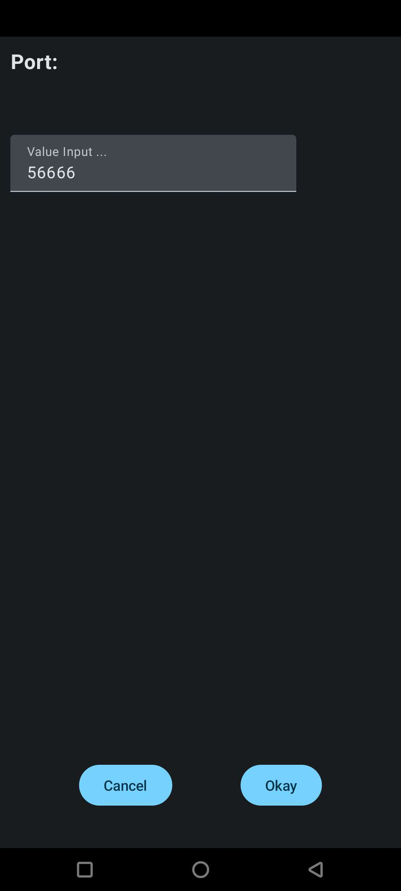

      After attached, all the functionality are the same as [above](#rooted-apk)

   1. ### run 
      ```
      adb shell
      ```

      ```
      cd /data/local/tmp
      ```
   1. ### Run the attach_client  
   
      ```
      ./attach_client
      ```
      Which should output:
      ```
      Connecting to ACE engine server...
      (Engine Server)
      ```

      Try to run `attached` command to see
      if it has been connected to the apk
      that we try to hack.
      ```
      (Engine Server) attached
      
      attached_ok
      ```
   1. Scanning and editing memory on this step is similliar to the step of rooted device, in fact all the commands is the same as the program for rooted device
      
      To scan for value 5

      ```
      (Engine Server) scan = 5
      ```
      To write value `1000` to all matches's addresses

      ```
      (Engine Server) write 1000 
      ```

      You can also use this as a library in your apk/project

      See the [docs here](https://github.com/KuhakuPixel/AceTheGame/blob/master/ACE/readme.md)

## BillingHack
- You just need to download `BillingHack.apk` and patch the game/apk, and then you can immediately use it :D
   > Visit [here](https://github.com/vlenv/AceTheGame/blob/master/installation_guide.md) to see how to patch the apk